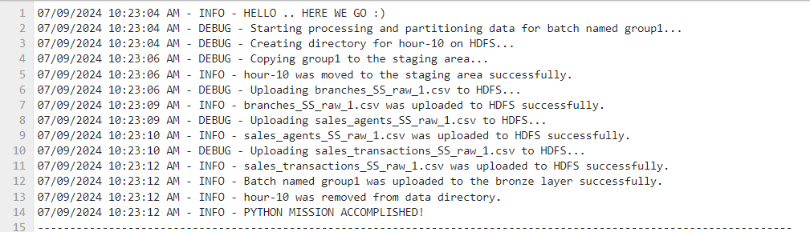
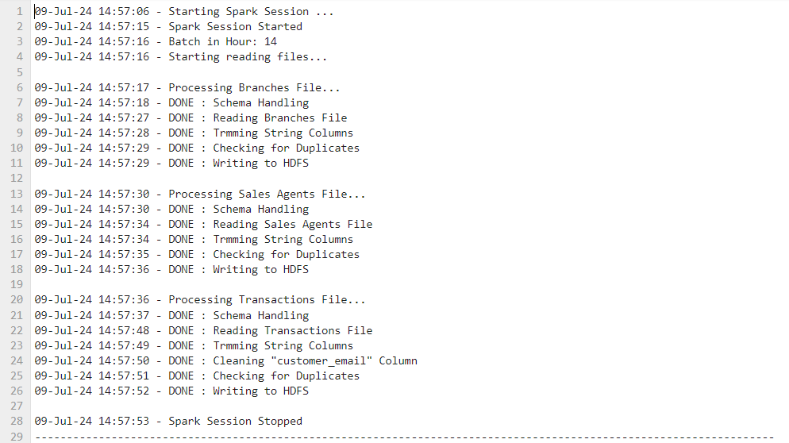
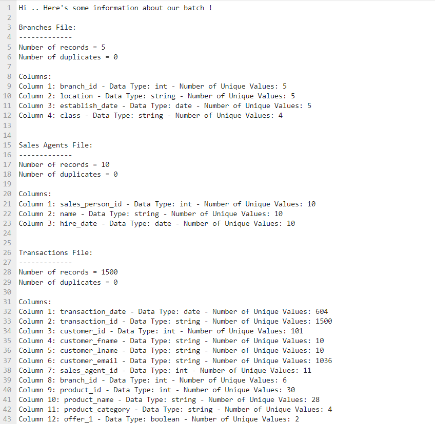
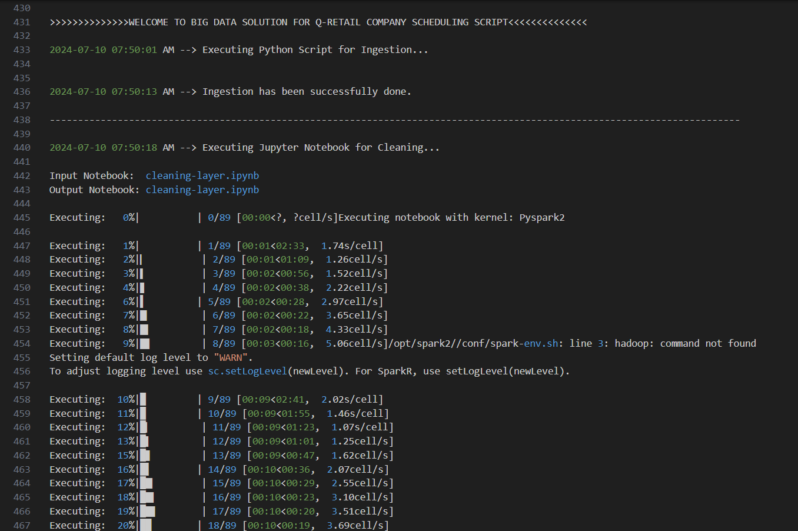

# Big-Data-Solution-for-Q-Retail-Company

## Overview of Batch Processing Pipeline

Our Batch Processing Pipeline consists of multiple stages and layers, started from the data source and ended with the serving layer which represents our the Q-Retail Company's clients.

The data source is divided into `6` batches. Each batch has 3 files, `branches_SS_raw_n.csv`, `sales_agents_SS_raw_n.csv`, and `sales_transactions_SS_raw_n.csv`, where `n` represents the batch number.

Data batches arrive hour-by-hour and need to be ingested as is in a *raw layer*, partitioned by days and hours, then get cleaned and transformed to be ready for the clients.

*The architecture of the pipeline is as follows:*
1. Bronze Layer &rarr; Ingesting data as is in.
2. Silver Layer &rarr; Data cleaning and pre-processing.
3. Gold Layer &rarr; Data transformation.

---

## Ingestion Layer | Bronze Layer

Ingestion layer moves the data from data source to the first layer which is the *Bronze Layer*.

[Python Code](ingestion-layer-code.py) is used to perform this task, and it's divided as follows:
1. Moving files to staging area
2. Partitioning files by day and hour
    a. Make a directory to represent the current date on HDFS under the Bronze directory
    b. For each batch, make a directory to represent the hour of ingestion (the current hour)
3. Uploading each batch's files (the 3 files) to the corresponding directory on HDFS
4. Removing the files from the data source to avoid uploading the same batch again

*Here is a snapshot of the Logs*

<div align="center">
  
  <p><em>Snapshot of Ingesting Batch 1</em></p>
</div>

---

## Cleaning Layer | Silver Layer

Cleaning layer is responsible of pre-processing data in *Bronze Layer* and store is in *Silver Layer*.

(Jupyer Notebook) is used to work on this stage. The code is written using `pyspark` and run on a `SparkSession`.

*It's divided into multiple tasks:*

1. Reading the 3 files in each ingested batch, file by file.
2. For each file:

    a. __Schema Handling:__ To infers a suitable schema to the file's columns

    b. __Trimming String Columns:__ To ensure a clean strings without any extra spaces

    c. __Cleaning `customer_email`:__ To get rid of any invalid emails such as those who have special characters or not following the email format
3. Loading the files again into __HDFS__ but in the *Silver Layer*.

This step also generates 2 types of logs:

1. Spark Job Logs
    - Logs the excution of the code
    <div align="center">
        
        <p><em>Snapshot of Spark Job Logs</em></p>
    </div>
2. Data Reports
    - Logs some information about each pre-processed file such as it's columns and their data types and whether it has duplicates or not.
    <div align="center">
        
        <p><em>Snapshot of Data Report</em></p>
    </div>

---

## Transformation Layer | Gold Layer

---

## Scheduling Technique

Mainly, we've `3` jobs to run in the batch pipeline, `ingestion`, `cleaning`, and `transformation`. They need to get executed on each batch sequentially. So, a [bash script](scheduling-script.sh) is used to perform this task, then it gets scheduled as a `cron-job`.

As mentioned, the script consists of the `3` jobs which run in order, job by job. First, the `ingestion-layer` code runs through the `python3` command.
```shell
/usr/bin/python3 ingestion-layer-code.py >> cron-logs/logfile-${today_date}.log 2>&1
```

Second, the `cleaning-layer` notebook runs through the `papermill` command through `Pyspark2` kernel.
```shell
/home/itversity/.local/bin/papermill cleaning-layer.ipynb cleaning-layer.ipynb -k Pyspark2 >> cron-logs/logfile-${today_date}.log 2>&1
```

Finally, the `transformation-layer` notebook runs through the same command `papermill` and through the same kernel `Pyspark2`.
```shell
/home/itversity/.local/bin/papermill transformation-layer.ipynb transformation-layer.ipynb -k Pyspark2 >> cron-logs/logfile-${today_date}.log 2>&1
```

After executing each job, the script checks if it's been done successfully or not and logs the time and log messages to a log file related to every day the jobs run.

It also supports a logging functionality to trace the behavior of the jobs while execution and check for any errors if something fails.

At the end, the script is scheduled as a `cron-job` using `crontab -e` command.
```shell
5 * * * * bash scheduling-script.sh
```

<div align="center">
    
    <p><em>Snapshot of Scheduling Log File</em></p>
</div>

---