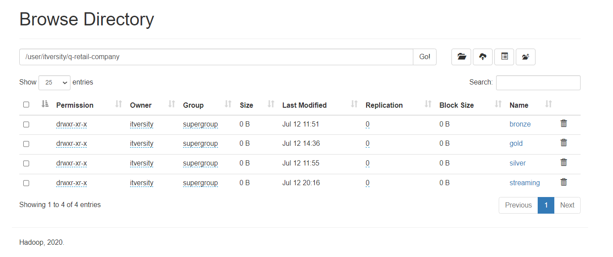

# Big-Data-Solution-for-Q-Retail-Company

## About our Customer

__Q Company__, specializing in retail, operates branches across various regions and utilizes an E-commerce platform. It needs to build a data pipeline to manage its day-to-day operations. The pipeline manages the data sources, data ingestion, transformation and processing, and serving layers using big data tools such as *Apache Spark* and *Apache Hive*.

---

## System Overview

<div align="center">
    
    <p><em>Big Data Solution Overview for Q-Retail Company</em></p>
</div>

Our data pipeline is just like any data engineering pipeline. It consists of the `5` famous stages:
- __Data Sources:__ Data comes from `2` sources, `csv` files (batch) and mobile application (streaming).
- __Ingestion:__ Ingesting data into a unified data storage system which is __HDFS__
- __Storage:__ Our main storage system is __HDFS__.
- __Transformation:__ Data processing is done using __Spark__ and __Spark Streaming__.
- __Serving:__ DWH Modeling in __Hive__ and Reporting.

The pipeline consists of `2` main parts, *Batch Processing* and *Stream Processing*.

So, our solution consists of many big data technologies and tools such as `Apache HDFS`, `Apache Spark`, `Apache Kafka`, and `Apache Hive`. Each service is used in a part of the system.
- `Apache HDFS`: used in data storage
- `Apache Spark`: used in data processing, in batch and streaming.
- `Apache Kafka`: used in stream processing.
- `Apache Hive`: used in building DWH model.

There're other tools used, `Python` is used in ingesting data into our system, and `Bash Scripting` for scheduling and orchestration.

---

## Repository Structure

This repository consists of `5` directories:
1. `Batch Processing`: A directory to hold the codes of batch part.
2. `Stream Processing`: A directory to hold the codes of streaming part.
3. `DWH Modeling`: A directory to hold the model of our DWH.
4. `Project Files`: The whole project files that are ready to be run on the docker image that is mentioned in the [itversity/data-engineering-spark](https://github.com/itversity/data-engineering-spark) repository.

    > To run the project, follow the steps in the [How to run ?](#how-to-run-) section.
5. `images`: A directory that holds the images used in the documentation.

---

## How to run ?

Our project is run on top of a docker container based on the [itversity/data-engineering-spark](https://github.com/itversity/data-engineering-spark) docker image. So, if you want to run the project, please follow the following steps:

1. Set up docker environment on your machine, pull the docker image and run a container from it.

2. Put all the files located in [Project Files](Project%20Files/) directory in `itversity-material/ITI_Material/Spark_Final_Project` located in the container.

3. Prepare HDFS:

    From the terminal of the container create the following directories under `/user/itversity/q-retail-company` directory:

    1. `bronze`, `silver`, and `gold`
    2. `streaming/data` and `streaming/checkpoint`

    <div align="center">
        
        <p><em>Preparing HDFS Environment</em></p>
    </div>

4. Open your terminal and run `crontab -e` then type the following line and choose whatever time to run the cron job.

    ```bash
    30 * * * * cd /home/itversity/itversity-material/ITI_Material/Spark_Final_Project && bash scheduling-script.sh >> log.log 2>&1
    ```

5. Wait for it, explore the logs, and enjoy!

---